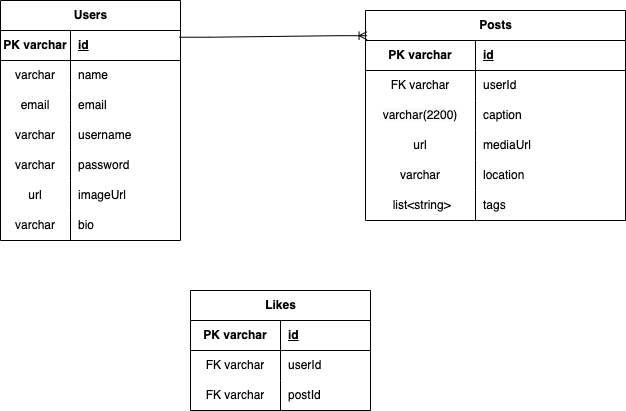

# Snapgram
Snapgram clone

# Snapgram APIs
- Create user account w/ basic info
- Create post
- get posts + like data + if post is liked by logged in user
- Search on captions
- create list of top creators
- create feed for user based on like data (do it last)
- List of Saved posts for a user

## Run local frontend
- npm install
- npm start

## Run local backend
- ./mvnw clean build
- run using IDE

## Data model
[Data model](https://app.diagrams.net/#G1yg6SCO9BjNiieXteEHKQUAWojveNmihG)
